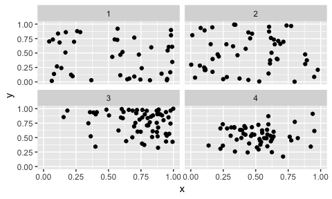

STAT 534 - Lecture 21
================

# Point Process Data

### Point Process Motivation

With point process data, the defining characteristic is that the
location is random. Sketch two hypothetical point processes: one with a
pattern and one without any spatial pattern.       How did you select
the number of points to add to your figure?  - *With*

  - *_Both_* 

There are many interesting questions related to point process data.
Consider, for example, locations of Ponderosa Pines and Aspen Trees.
With location data for these trees, we can answer the following
questions:

  - *What* 
  - *Do* 
  - *Can* 

Point process data is also prevalent in public health settings; in this
context the goal is to understand disease patterns.  - *Are*  - *Do*  -
*Is* 

If there is additional meta-information associated with a point pattern,
this can be used in what is known as a *marked* point process. For
instance, the location of a tree could be considered the point process
with the marks associated with tree species.

Discuss the interpretation of marked point process data set with
continuous data. For instance, suppose that rather than tree species
that the height of the tree was collected. What questions would be of
interest?

### Exploratory Point Process Analysis

With point process data, there are a few things to assess.

*1.* 

 *2.*  *3.*  *4.* 

### Theoretical Details

  - Our focus will be largely on \(\mathcal{R}^2\), but the same
    principles apply for other dimensions.

<!-- end list -->

  - A random realization of a point pattern is denoted \(\mathcal{S}\)
    with elements \(\boldsymbol{s}_1, \dots, \boldsymbol{s}_n\). Hence,
    \(\mathcal{S}\) is random and inference focuses on a probabilistic
    model for \(\mathcal{S} \in \mathcal{D}\).

To specify a probabilistic model for \(\mathcal{S}\), there are two
essential elements.

1.  

2.  
<!-- end list -->

  - Then the likelihood of \(\mathcal{S}\) can be written as
    \[\mathcal{L}(\mathcal{S}) = Pr(\mathcal{N}(d) = n) n! f(\boldsymbol{s}_1, \dots,  \boldsymbol{s}_n)\]
    
  - Given the likelihood,  

#### Counting Measure

  - The first part of a point process is the number of points. 
  - *Let* 
  - One common approach for the counting measure is a Poisson Process. 
  - *Thus* 

<!-- end list -->

  - If \(\mathcal{B}_1\) and \(\mathcal{B}_2\) are disjoint, then
    \(N(\mathcal{B})_1\) and \(N(\mathcal{B})_2\) are independent. 
  - Sketch \(\mathcal{D}\) such that \(\mathcal{B}_1\) and
    \(\mathcal{B}_2\) are disjoint.     
  - What would \(\lambda(\mathcal{B}_1)\) and \(\lambda(\mathcal{B}_2)\)
    be if we had spatial homogeneity? 
  - When \(\lambda(\boldsymbol{s}) = \lambda,\) this is referred to as a
    homogenous Poisson process (HPP). 
  - *Then* 
  - What is the expected number of points for a HPP in \(\mathcal{B}\)? 
  - Note
    \(\lambda(\mathcal{D}) = \int_D \lambda{\boldsymbol{s}} d\boldsymbol{s}\)
    is an intensity measure, not a probability distribution. What, in
    general, is necessary to normalize the location density?  

#### Nonhomogenous Poisson process

  - A HPP is the simplest form of a point process, sketch the intensity
    function or a nonhomogenous Poisson process (NHPP). Label the
    intensity \(\lambda(\boldsymbol{s})\) on your figure.    
  - *When* 
  - *With* 
  - *The*
